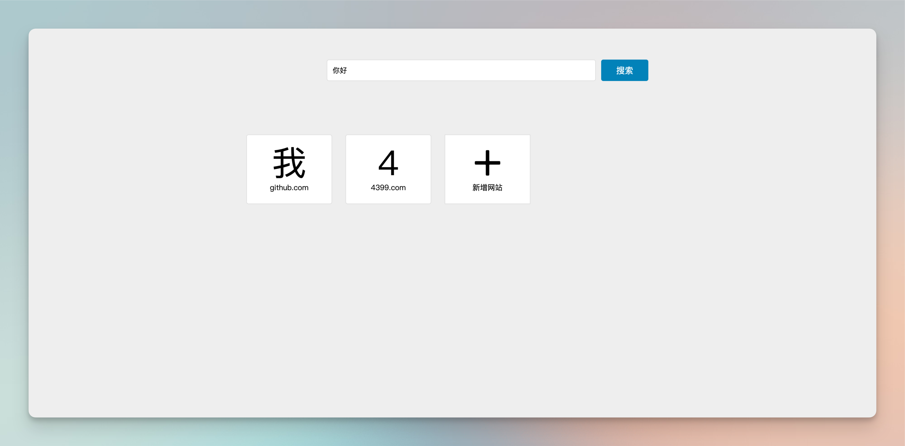

# 艺简导航

[English]('./README.md') | 中文

## 预览

[https://layouwen.github.io/yj-nav/src](https://layouwen.github.io/yj-nav/src)

## 介绍

艺简导航是基于 jQuery 编写的一个简单导航页面. 适合 jQuery 初学者参考相关的用法.

## 特性

- 支持 PC/移动端浏览
- 支持百度搜索
- 支持自定义导航链接
- 本地存储数据

## 联系我

[Github](https://github.com/layouwen)